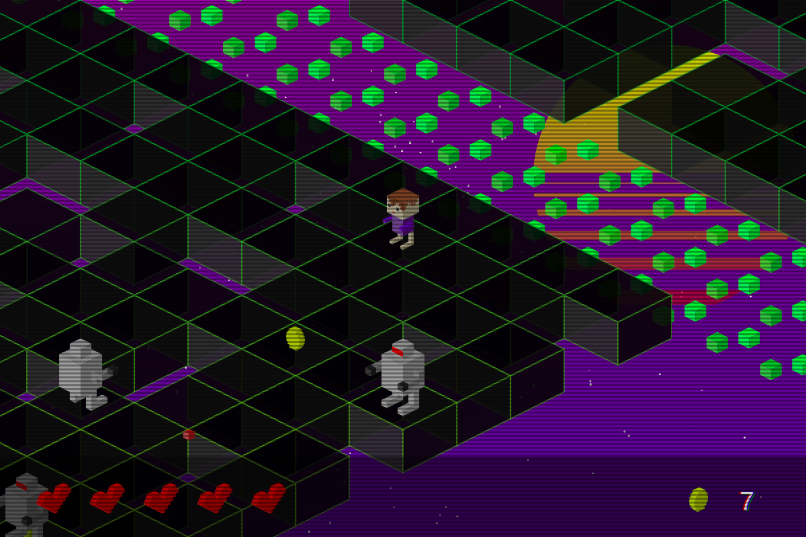
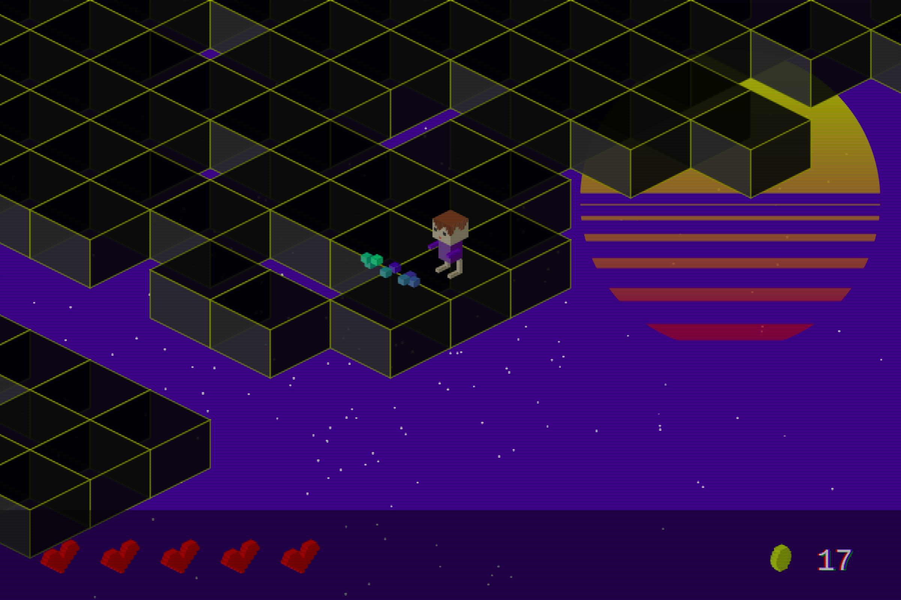

# Welcome to the cyberspace
## Retro space shooter

This is a repository for "Welcome to the cyberspace" - the videogame created in 13kb for JS13kGame 2018 challenge.

## [Play the game](https://kulak-at.github.io/welcome-to-the-cyberspace)

## [Download Zip File (12681 bytes)](https://github.com/kulak-at/welcome-to-the-cyberspace/raw/master/build.zip)

# Description
Fight with the cybernetic hordes and restore the connection to the real world in this isometric retro-style cyberspace shooter. Can you beat them?

# Controls
Use arrowkeys to control the character. Use X to shoot and Z to use the shield (further in the game).
You can also use any standard controller (PS3/PS4/XBox) - I have tested PS3 controller clone and NES controller clone and they work great!

# Screenshots

